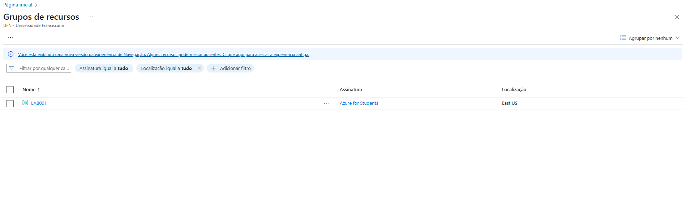
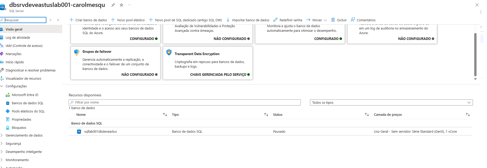
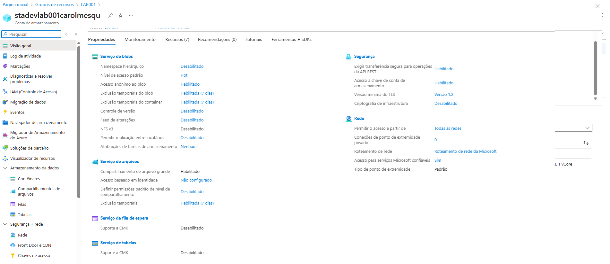
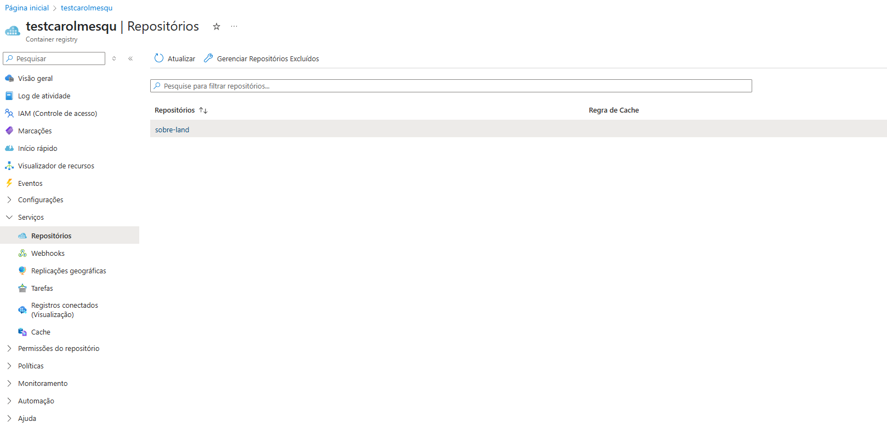

# Projeto Azure - Gerenciamento de Recursos, SQL Server e Blob Storage

## 📌 Descrição
Este projeto foi desenvolvido como parte do curso, com o objetivo de praticar a criação e gerenciamento de recursos na plataforma Microsoft Azure. Durante o processo, configurei um ambiente básico com:

- Um **Grupo de Recursos**
- Um **SQL Server** com banco de dados
- Um **Blob Storage** para armazenamento de imagens

---

## 🚀 Etapas do Projeto

### 1️⃣ Criação do Grupo de Recursos
O primeiro passo foi criar um **Resource Group** para organizar todos os recursos relacionados ao projeto.

---

### 2️⃣ Configuração do SQL Server + Banco de Dados
Em seguida, configurei o **SQL Server** e criei uma instância de banco de dados para armazenamento de dados relacionais.

---

### 3️⃣ Criação do Blob Storage
Por fim, configurei o **Blob Storage** para armazenar arquivos, como imagens.

---

### 4️⃣ Criação do Azure Kubernetes Service
Orquestração de Contêineres com AKS

Durante o desenvolvimento, explorei também a orquestração de contêineres utilizando o Azure Kubernetes Service (AKS). Essa etapa permitiu aprofundar o conhecimento sobre como implementar e gerenciar aplicações em contêineres de forma escalável na nuvem.

✅ Etapas realizadas:

- Acessei o portal do Azure e configurei o serviço AKS, criando o cluster com sucesso.
- Registrei o repositório de contêineres chamado testcarolmesqu no serviço Azure Container Registry (ACR).
- Subi para o ACR um contêiner simples de um projeto HTML, replicando o exemplo do professor.

📦 Sobre o projeto enviado:
O contêiner enviado contém uma página HTML básica, funcionando como exemplo prático de como fazer o deploy de aplicações containerizadas no AKS.

---

## 💡 Insights e Aprendizados

- Entendi a importância do **Resource Group** para organizar e gerenciar custos e recursos de forma eficiente.
- Aprendi a configurar rapidamente um ambiente de banco de dados com o **Azure SQL Server**, incluindo regras de firewall e conexões seguras.
- Descobri como o **Blob Storage** é uma solução prática e escalável para armazenamento de arquivos na nuvem.
- A integração entre serviços do Azure é simples e poderosa, abrindo portas para automações e soluções mais robustas.
- Conheci na prática o processo de orquestração de contêineres com o Azure Kubernetes Service (AKS) e a publicação de imagens usando o Azure Container Registry (ACR).
- Consegui criar e publicar uma aplicação HTML em um contêiner, o que reforçou meu entendimento sobre deploys modernos em ambientes de nuvem e escalabilidade com Kubernetes.

---

## 🔮 Possibilidades Futuras

- Configurar automações para mover dados entre o SQL Server e o Blob Storage.
- Implementar políticas de segurança e backups automáticos.
- Integrar o armazenamento com uma aplicação web para upload e gerenciamento de imagens.
- Explorar o uso de **Azure Functions** para processamento automático de arquivos no Blob.

---

## 📎 Conclusão
Essa experiência me proporcionou uma visão prática sobre como estruturar recursos na nuvem usando o Azure. Com esses conhecimentos, é possível desenvolver soluções escaláveis e seguras para diversos tipos de aplicações.

---

